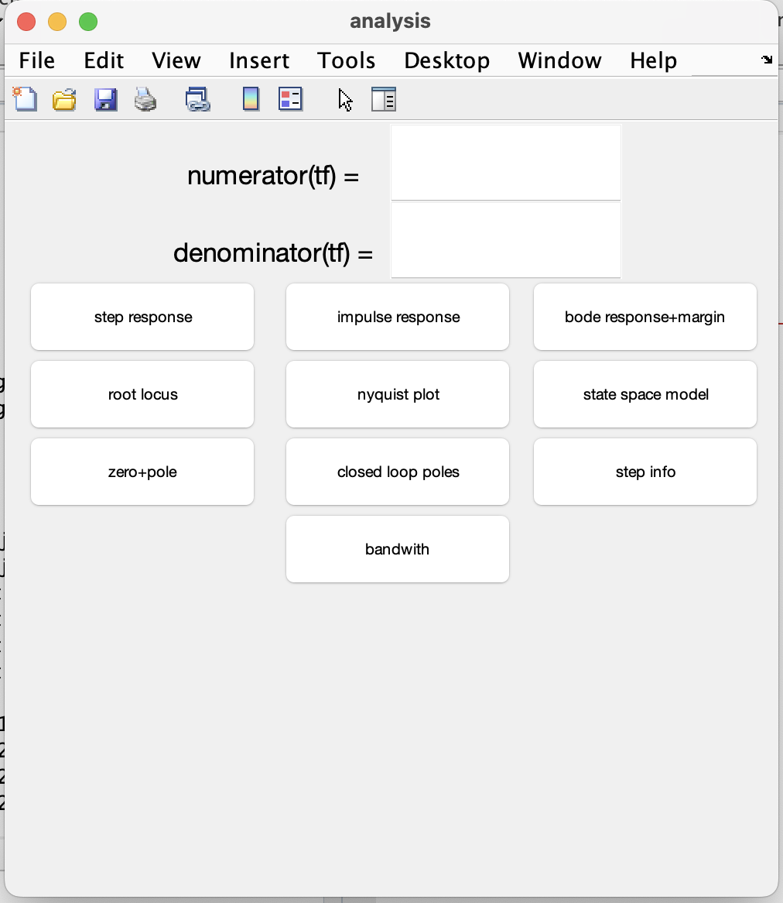

# interactive matlab gui toolkit 

this project is a collection of simple, interactive gui applications i built in matlab using buttons, text fields, and callback functions. all projects were done out of personal interest to explore gui-based applications.

##  what’s included

### 1. calculator gui 
a basic calculator that can perform `+`, `-`, `*`, `/` operations between two user-input numbers with built-in error messages for invalid entries.

### 2. temperature converter 
enter value in either celsius, kelvin, or fahrenheit and get instant conversion to the other two. built using editable text fields and callback logic.

### 3. control systems plot gui 
enter numerator and denominator of a transfer function and generate:
- step response
- impulse response
- bode plot
- nyquist plot
- root locus

### 4. waveform generator 
create and visualize:
- sine wave
- square wave
- triangle wave
- ramp function

##  screenshots
here are some example views of the guis:

##  run the files
just open each `.m` file in matlab and run it. make sure your version supports `uicontrol`, `callback` functions, etc.

---

these mini projects helped me learn how to build user-friendly interfaces in matlab, handle events, manage user input, and visualize data dynamically.
